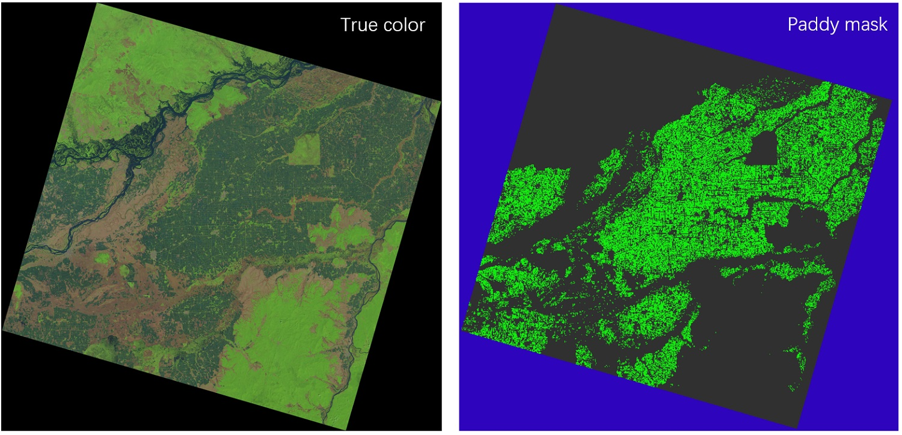

# Updating April 27, 2025
Implementation codes of FS-Net and the training samples of Landsat data are underway 


# Implementation of 
[A full resolution deep learning network for paddy rice mapping using Landsat data](https://www.sciencedirect.com/science/article/pii/S0924271622002672)

    1. Requirements

  (a). Tensorflow/Keras > 2.6  
  (b). GDAL

We suggest using Conda to set the environment.<br><br>

    2.Run
```python shuidao.py```

We will upload some training samples so anyone downloads the codes and run them directly.<br><br>

    3.Dataset
The training dataset locates in the folder of the dataset. For each image, 1 indicates paddy, 0 indicates nonpaddy, and 3 means background which should be masked when you generate the training samples, e.g. size of 256*256. 

For better visualization, ArcGIS is suggested to open the image, and Layer Properties -> Symbology -> Unique values should be employed. One demo is shown below.





